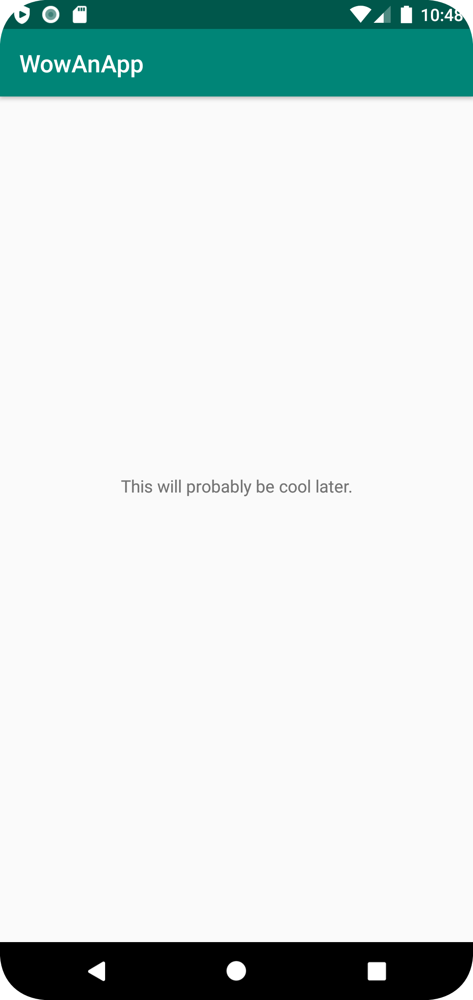

# Rapport

Det som gjordes i denna commit var att ändra texten “Hello World!” på hemskärmen av appen. I filen strings.xml lades det till en ny string (new_message), och stringen som höll namnet på appen ändrades till “WowAnApp”.
I content_main togs “Hello World!” bort och istället lades den nya stringen till med “@string/new_message”.

```
<resources>
    <string name="app_name">WowAnApp</string>
    <string name="action_external_web">External Web Page</string>
    <string name="action_internal_web">Internal Web Page</string>
    <string name="new_message">This will probably be cool later.</string>
</resources>
```
```
<TextView
    android:layout_width="wrap_content"
    android:layout_height="wrap_content"
    android:text="@string/new_message"
    app:layout_constraintBottom_toBottomOf="parent"
    app:layout_constraintLeft_toLeftOf="parent"
    app:layout_constraintRight_toRightOf="parent"
    app:layout_constraintTop_toTopOf="parent" />
```

